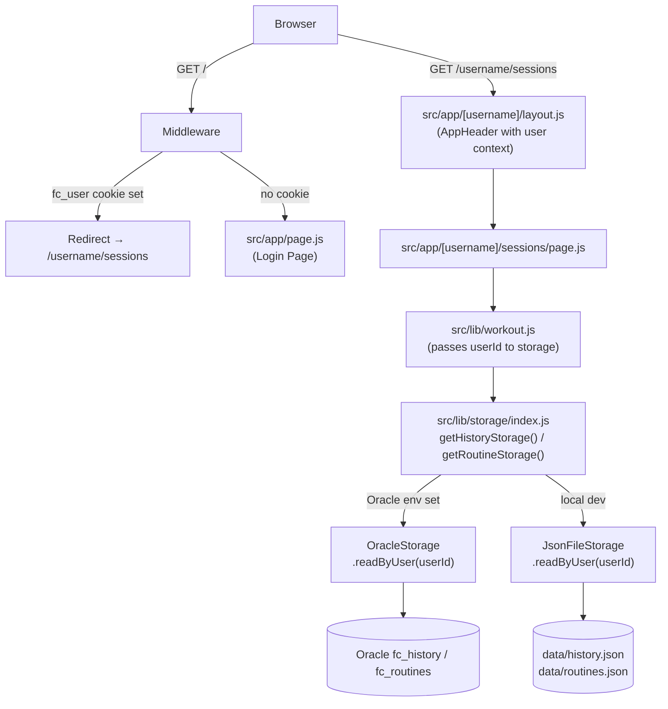

# Design Document — Multi-User Profiles

## Overview

Multi-user profiles adds lightweight, cookie-based user identity to fit-circle. Rather than a shared single-user view, each user gets a namespaced URL space (`/<username>/…`) and isolated routine and history data. There is no password or authentication: selecting a user card on the login page writes a `fc_user` cookie, and all subsequent reads and writes are scoped to that user's `username`. Global collections (exercises, books) are unaffected and remain shared.

The feature touches four areas:

1. **Storage layer** — a new `getUserStorage()` factory and a `readByUser(userId)` method on routines/history adapters.
2. **Route structure** — the existing `(fit)` route group is renamed to the `[username]` dynamic segment; a new `/users` page and an updated `/` login page are added.
3. **Middleware** — a root `middleware.js` redirects `/` → `/<username>/sessions` when the cookie is already set.
4. **UI components** — `AppHeader` gains avatar/user display; the login page replaces the current home page.

### Key design decisions

| Decision | Choice | Rationale |
|---|---|---|
| Authentication mechanism | `fc_user` cookie, pure `document.cookie` | Zero-dependency; no auth complexity needed for a personal-use app |
| Route namespacing | `[username]` dynamic segment (rename `(fit)` group) | Natural URL ownership; every deep link is inherently scoped to a user |
| Data scoping at storage layer | `readByUser(userId)` method on storage adapter | Keeps filtering close to the data; lib layer passes `userId` rather than filtering after full reads |
| Migration of legacy records | In-code default fallback `userId: "im"` at read time | No file mutation needed; works for both JSON and Oracle backends |
| Cookie library | None — bare `document.cookie` | Keeps the dependency list minimal |

---

## Architecture

The diagram below shows how a per-user page request flows through the system after this feature lands.



### Global vs per-user routes

```
/                       → Login page (server component, fetches users)
/users                  → User management page (global, no username prefix)
/exercises              → Exercises page (global, shared)
/books                  → Books page (global, shared)
/[username]/sessions    → Active workout page (per-user)
/[username]/routines    → Routines list (per-user)
/[username]/routines/[id] → Routine detail (per-user)
/[username]/history     → History list (per-user)
/[username]/history/[id] → Session detail (per-user)
```

---

## Components and Interfaces

### Storage adapters — new `readByUser(userId)` method

Both `JsonFileStorage` and `OracleStorage` gain a `readByUser(userId)` method. `readAll()` is unchanged (used by admin/dump scripts). The lib layer calls `readByUser` and passes the `userId` from the URL param or request context.

```js
// Storage adapter interface (both adapters implement this)
{
  readAll(): Promise<Item[]>,
  readByUser(userId: string): Promise<Item[]>,
  writeAll(items: Item[]): Promise<Item[]>,
}
```

**JsonFileStorage** — `readByUser` reads the full JSON file then filters:
```js
async readByUser(userId) {
  const items = await this.readAll();
  return items.filter(item => (item.userId ?? "im") === userId);
}
```

The `?? "im"` fallback handles legacy records without a `userId` field (Requirement 5.3 / 6.3).

**OracleStorage** — `readByUser` adds a `WHERE JSON_VALUE(data, '$.userId') = :userId` clause to avoid full-table reads at scale:
```sql
SELECT JSON_SERIALIZE(data RETURNING CLOB) AS data
FROM fc_routines
WHERE JSON_VALUE(data, '$.userId') = :userId
   OR (JSON_VALUE(data, '$.userId') IS NULL AND :userId = 'im')
ORDER BY sort_order
```

### `src/lib/storage/index.js` — `getUserStorage()`

```js
export function getUserStorage() {
  return createStorage("users");
}
```

Oracle `TABLE_CONFIG` gains:
```js
users: {
  table: "fc_users",
  orderBy: "id",
  writeRows: writeUserRows,
}
```

`oracle-schema.js` gains the `fc_users` DDL:
```sql
CREATE TABLE fc_users (
  id VARCHAR2(64) PRIMARY KEY,
  data JSON NOT NULL
)
```

### Middleware — `middleware.js` (project root)

```js
import { NextResponse } from "next/server";

export function middleware(request) {
  const { pathname } = request.nextUrl;
  if (pathname !== "/") return NextResponse.next();

  const username = request.cookies.get("fc_user")?.value;
  if (username) {
    return NextResponse.redirect(new URL(`/${username}/sessions`, request.url));
  }
  return NextResponse.next();
}

export const config = {
  matcher: ["/"],
};
```

Using `matcher: ["/"]` means Next.js only invokes this middleware for the exact root path; all other routes are unaffected.

### Login page — `src/app/page.js`

Server component: fetches all users from `getUserStorage().readAll()`, passes them to a client component for cookie handling.

```js
// src/app/page.js  (server)
import LoginClient from "./login-client";
import { getUserStorage } from "@/lib/storage";

export default async function LoginPage() {
  const users = await getUserStorage().readAll();
  return <LoginClient users={users} />;
}
```

```js
// src/app/login-client.js  (client)
"use client";
import { useRouter } from "next/navigation";

export default function LoginClient({ users }) {
  const router = useRouter();

  function handleSelect(username) {
    document.cookie = `fc_user=${username}; path=/`;
    router.push(`/${username}/sessions`);
  }

  return (
    <div>
      {users.map(user => (
        <button key={user._id} onClick={() => handleSelect(user.username)}>
          <span>{user.avatar}</span>
          <span>{user.displayName}</span>
        </button>
      ))}
    </div>
  );
}
```

### Route group rename — `(fit)` → `[username]`

`src/app/(fit)/` becomes `src/app/[username]/`. The `sessions` route (formerly the `(fit)` index page) moves to `src/app/[username]/sessions/`. The dynamic `params.username` is available to all server components and passed as a prop or read via `useParams()` in client components.

Layout receives `params`:
```js
// src/app/[username]/layout.js
export default async function UserLayout({ children, params }) {
  const { username } = await params;
  return (
    <>
      <AppHeader username={username} />
      {children}
    </>
  );
}
```

Page components that call the lib layer now forward `username` as `userId`:
```js
// src/app/[username]/sessions/page.js
export default async function SessionsPage({ params }) {
  const { username } = await params;
  const { routines, activeSession, activeRoutine } =
    await getWorkoutHomeData(username);
  // …
}
```

### `AppHeader` — updated for user identity

`AppHeader` becomes a server component at the layout level (receives `username` as a prop) but keeps a thin client wrapper where `usePathname()` is needed for active-link detection.

```js
// Receives username prop from [username]/layout.js
// Reads avatar/displayName from getUserStorage by username
// Nav links use /<username>/sessions, /<username>/routines, etc.
```

Cookie is read at server render time via `headers()` → `cookie()` (in the layout), **or** the `username` is simply forwarded from `params` — no client-side `useEffect` cookie read is needed because `params.username` is already available in the server layout. The `AppHeader` only needs `usePathname` for active-link highlighting, which stays in a `"use client"` sub-component.

### `/users` page — `src/app/users/page.js`

Server component shell + `UsersClient` client component. Follows the same pattern as other pages.

```
UsersPage (server)
  └─ UsersClient (client)
       ├─ UserCard × N
       └─ EditUserDialog (reuses existing dialog pattern)
```

`EditUserDialog` calls `PATCH /api/users/[id]` on confirm and updates local state. Cancel discards changes without any API call.

### API routes — new and updated

| Route | Change |
|---|---|
| `GET /api/users` | New — returns `getUserStorage().readAll()` |
| `POST /api/users` | New — creates user, 409 on duplicate `username` |
| `PATCH /api/users/[id]` | New — updates `displayName`/`avatar`, 404 if not found |
| `GET /api/routines` | Updated — accepts `?userId` query param |
| `POST /api/routines` | Updated — requires `userId` in body |
| `PATCH /api/routines/[id]` | Updated — scopes write to `userId` |
| `DELETE /api/routines/[id]` | Updated — scopes delete to `userId` |
| `GET /api/history` | Updated — accepts `?userId` query param |
| `POST /api/history` | Updated — requires `userId` in body |
| `PATCH /api/history/[id]` | Updated — scopes write to `userId` |

---

## Data Models

### User record

```ts
interface User {
  _id: string;        // same as username (e.g. "im")
  username: string;   // slug-style identifier
  displayName: string;
  avatar: string;     // emoji character or image URL
}
```

### Updated Routine record

```ts
interface Routine {
  _id: string;
  userId: string;     // NEW — username of the owner
  Name: string;
  Items: RoutineItem[];
}
```

### Updated History session record

```ts
interface HistorySession {
  _id: string;
  userId: string;     // NEW — username of the owner
  date: string;
  startedAt: string;
  routineId: string;
  routineName: string;
  status: "active" | "completed" | "cancelled";
  completedItems: CompletedItem[];
  weightQueues: Record<string, number[]>;
}
```

### Seed users — `data/users.json`

```json
[
  { "_id": "im", "username": "im", "displayName": "IM", "avatar": "🏋️" },
  { "_id": "mm", "username": "mm", "displayName": "MM", "avatar": "🧘" }
]
```

### Migration strategy

Existing `data/routines.json` and `data/history.json` records have no `userId` field. No file mutation is performed. Instead, `readByUser(userId)` applies a runtime fallback:

```js
item.userId ?? "im"
```

Records without a `userId` field are treated as belonging to `"im"`. This is applied at the storage adapter level so the rest of the codebase sees a consistent model. On the first write for a record (e.g. completing an exercise), the `userId` is written explicitly, permanently upgrading that record.

---

## Correctness Properties

*A property is a characteristic or behavior that should hold true across all valid executions of a system — essentially, a formal statement about what the system should do. Properties serve as the bridge between human-readable specifications and machine-verifiable correctness guarantees.*

### Property 1: User record round-trip preserves all fields

*For any* User record with valid `_id`, `username`, `displayName`, and `avatar` values, writing then reading back from User_Storage should return an object with all four fields equal to the original values.

**Validates: Requirements 1.1**

---

### Property 2: Login page renders one card per user

*For any* non-empty list of User records, the LoginClient component should render exactly one card per user, and each card should display the user's `avatar` and `displayName`.

**Validates: Requirements 2.2, 2.5**

---

### Property 3: Cookie navigation targets correct URL

*For any* username string, selecting that user on the login page should set the `fc_user` cookie to that exact username and navigate to `/<username>/sessions`.

**Validates: Requirements 2.3, 2.4**

---

### Property 4: Middleware redirects to correct per-user URL

*For any* username value stored in the `fc_user` cookie, a request to `/` should be redirected to `/<username>/sessions` where `<username>` is exactly the cookie value.

**Validates: Requirements 3.1**

---

### Property 5: Middleware passes through for all non-root paths

*For any* request path that starts with a segment other than `/` (i.e. `/<username>/`, `/exercises`, `/books`, `/users`, `/api/`), the middleware should pass the request through without any redirect.

**Validates: Requirements 3.3**

---

### Property 6: readByUser returns only matching userId records

*For any* collection of routine or history records containing mixed `userId` values, calling `readByUser(userId)` for any given `userId` should return a list where every record's `userId` equals the requested value (applying the `"im"` fallback for records without a `userId` field).

**Validates: Requirements 5.1, 6.1, 10.4**

---

### Property 7: userId is preserved on write

*For any* routine or history record written with a given `userId`, reading that record back via `readByUser(userId)` should return the record with the `userId` field equal to the value it was written with.

**Validates: Requirements 5.2, 6.2**

---

### Property 8: Legacy records without userId belong to "im" only

*For any* routine or history record that has no `userId` field, that record should appear in `readByUser("im")` results and must not appear in `readByUser(userId)` results for any `userId` other than `"im"`.

**Validates: Requirements 5.3, 6.3, 10.5**

---

### Property 9: GET /api/routines and GET /api/history return no cross-user records

*For any* userId value X passed as a query parameter, the API endpoints `GET /api/routines?userId=X` and `GET /api/history?userId=X` should return a list in which every record has `userId === X` (no records from other users).

**Validates: Requirements 5.4, 6.4, 10.4**

---

### Property 10: Write operations scope userId correctly

*For any* POST or PATCH to `/api/routines` or `/api/history` that includes a `userId` field, the stored record should have that exact `userId` value, and `readByUser` for a different userId should not return that record.

**Validates: Requirements 5.5, 6.5**

---

### Property 11: POST /api/users creates complete record

*For any* valid `{ username, displayName, avatar }` payload, `POST /api/users` should return a 201 response whose body contains all three fields with values equal to those submitted.

**Validates: Requirements 7.2**

---

### Property 12: PATCH /api/users updates displayName and avatar

*For any* existing user and any new `{ displayName, avatar }` values, `PATCH /api/users/[id]` should return the updated user record with exactly the new field values, leaving `_id` and `username` unchanged.

**Validates: Requirements 7.4**

---

### Property 13: AppHeader nav links contain correct username

*For any* username value present in the context, the AppHeader should render navigation links where Sessions, Routines, and History hrefs contain that exact username as the first path segment.

**Validates: Requirements 9.2, 9.3**

---

### Property 14: AppHeader highlights the active route

*For any* username and any of the defined route prefixes (`/sessions`, `/routines`, `/history`, `/exercises`), the AppHeader rendered with that pathname should mark exactly one nav link as active, and the active link should match the route prefix of the current pathname.

**Validates: Requirements 9.4**

---

## Error Handling

### Storage errors

- `readByUser` / `readAll` propagate I/O errors; callers (page server components and API routes) return 500 with a generic error message.
- Oracle connection failures bubble up through `withOracleConnection`; the existing error handling there is unchanged.

### API validation errors

| Condition | Response |
|---|---|
| `POST /api/users` with duplicate `username` | 409 Conflict `{ error: "username already exists" }` |
| `PATCH /api/users/[id]` for unknown id | 404 Not Found `{ error: "user not found" }` |
| `POST /api/history` or `/api/routines` missing `userId` | 400 Bad Request `{ error: "userId is required" }` |
| `GET /api/routines` or `/api/history` missing `?userId` | 400 Bad Request `{ error: "userId query param is required" }` |

### Middleware edge cases

- If the `fc_user` cookie is set to a value that does not correspond to any real user, the middleware still redirects to `/<cookie_value>/sessions`. The sessions page will render with empty data (no routines/history for an unknown userId). This is acceptable for a no-auth app; a 404 guard can be added later.

### Login page

- If `getUserStorage().readAll()` fails at render time, the page returns a 500. No partial render.

---

## Testing Strategy

### Unit tests

- `readByUser` filter logic: given an array of records with mixed `userId` values, verify correct filtering including the `"im"` fallback.
- `getUserStorage()` factory: verify it returns the correct adapter based on env vars.
- Middleware logic: given a mock `NextRequest`, verify redirect vs pass-through for each case.
- `LoginClient`: render with mock users, verify correct number of cards, cookie written on click, router called with correct path.
- `AppHeader`: render with different usernames and pathnames, verify nav links and active state.
- `/api/users` route handlers: verify 201 on create, 409 on duplicate, 404 on PATCH unknown id.

### Property-based tests

The feature uses [fast-check](https://github.com/dubzzz/fast-check) for property-based testing. Each property test runs a minimum of 100 iterations.

Each test is tagged with its design document property:
> `// Feature: multi-user-profiles, Property N: <property text>`

Properties covered:

| Property | Test description |
|---|---|
| P1 | Round-trip user record through storage preserves all fields |
| P2 | LoginClient renders one card per user with correct avatar/displayName |
| P3 | Cookie + navigation targets `/<username>/sessions` for any username |
| P4 | Middleware redirects to `/<username>/sessions` for any `fc_user` cookie value |
| P5 | Middleware passes through for any non-root path |
| P6 | `readByUser(userId)` returns only records whose `userId` matches (including "im" fallback) |
| P7 | Written record's `userId` is retrievable via `readByUser` |
| P8 | Records without `userId` appear only under `readByUser("im")` |
| P9 | API GET returns no cross-user records for any `userId` |
| P10 | Write operations correctly stamp `userId` on stored records |
| P11 | POST /api/users 201 response contains all submitted fields |
| P12 | PATCH /api/users returns updated fields with unchanged id/username |
| P13 | AppHeader nav hrefs contain the current username |
| P14 | AppHeader highlights exactly one nav link matching current route |

### Integration tests

- End-to-end page render for `/<username>/routines` and `/<username>/history` with mixed-user seed data: verify only the correct user's records appear.
- Oracle adapter: `readByUser` with real Oracle connection returns correct scoped results.
- `dump:oracle` script includes `users` collection.

### Snapshot tests

- Route file layout (structural smoke test): verify `src/app/[username]/` directory tree contains `sessions/`, `routines/[id]/`, `history/[id]/`.
